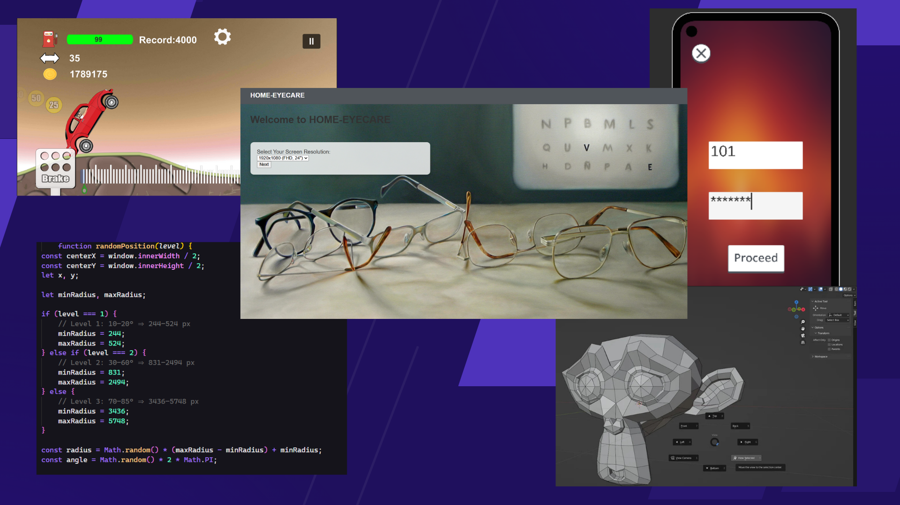

# Sumit Kumar Sahu

**DOB:** 21 October 2004  
**Location:** Bhubaneswar, Khorda, Odisha  

📞 (+91) 7978043970  
✉️ [ksumit21sahu@gmail.com](mailto:ksumit21sahu@gmail.com)

  
  

---

## 🎓 Education
- **National Institute of Technology, Rourkela** (Sept 2023 – Present)  
  *B.Tech in Computer Science and Engineering* — **CGPA: 8.39**  
- **ODM Public School, Bhubaneswar** (May 2022)  
  *AISCCE – CBSE, Science (PCM)* — **93.4%**  
- **KV No-3, Bhubaneswar** (May 2020)  
  *AISCCE – CBSE, Science (PCM, SST, Hindi, IT)* — **95.7%**  

---

## 📚 Relevant Coursework
- Data Structures and Algorithms  
- Database Management and Systems  
- Object-Oriented Programming  

---

## 💼 Work Experience
### Unity Developer Intern – **PFC Gaming** (June 2025 – Present) | Bhubaneswar (Remote)  
- Published **3+ Android games** on Google Play Store.  
- Improved bug-fix turnaround by **30%** using clean C# code and Azure.  
- Integrated **Appodeal/AdMob**, resolving Gradle conflicts and increasing ad revenue by **20%**.  

### Full Stack Web Dev & AR Intern – **Eyesphere Medicare** (May 2025 – June 2025) | Bhubaneswar (Remote)  
- Built and deployed a **full-stack vision testing app** with Django + PostgreSQL, improving data consistency by **42%**.  
- Developed an **AR vision-testing app** with Google ARCore + Unity XR for remote eye screening.  

### Research Intern – **IIT Bhubaneswar** (May 2025 – July 2025) | Bhubaneswar (Onsite)  
- Researched **Object Detection in Adverse Weather**, analyzing de-snowing algorithms and proposing performance improvements.  
- Annotated **1.2K+ images** with 5+ labels each, enabling YOLOv8 training and boosting detection accuracy.  

---

## 🚀 Projects
### [Elite Support – Call Center Analytics](https://callcenter-rho.vercel.app/)  
*Python, Django, Bash, WebSockets, Channels, REST API, SQLite*  
- Built **real-time call center analytics platform** with Hugging Face NLP for live sentiment analysis.  
- Cut server latency by **36.7%**, optimized queries, and improved load speed by **73.2%**.  
- [GitHub Repo](https://github.com/ASUR12ZURVAN/JUNE-Cohort)  

### [Travelsiders – AI Travel Planner](https://travelsiders.vercel.app/)  
*Python, Django, Bash, REST API, SQLite*  
- AI-powered travel planner automating itineraries, boosting user efficiency by **40%**.  
- Integrated Groq-Cloud LLM for **budget-friendly stays and food (20% cheaper)**.  
- [GitHub Repo](https://github.com/ASUR12ZURVAN/APRIL-COHORT)  

---

## 🏆 Achievements & Certifications
- **National Semifinalist – Flipkart Grid 7.0** (Aug 2025)  
  *Ranked Top 1% out of 50,000+ participants.*  
  [Certificate](https://drive.google.com/file/d/1dGbroV61UBJKpxLK_ctVxs2udnCWT9bg/view)  

- **Certificate of Appreciation – Opencode21** (Dec 2024)  
  *Recognized for open-source contributions at IIIT Allahabad.*  
  [Certificate](https://media.licdn.com/dms/image/v2/D5622AQHKGGpBMfKGPQ/feedshare-shrink_2048_1536/B56ZX0Xk0qGUAs-/0/1743561579260?e=1756339200&v=beta&t=goUJvjwk71jMO4QoOxWMGCEklPeqBd59xXLu7Hwm9lY)  

---

## 🛠 Technical Skills
- **Languages:** C, C++, C#, Python  
- **Operating Systems:** Windows, Linux  
- **Developer Tools:** VS Code, Visual Studio, MonoDevelop, PyCharm  
- **Frameworks/Tech:** Tailwind, Django, REST, WebSockets, Unity, Firebase, ByteBrew  

---

## 🎮 Extracurricular Activities
**Vice President – Game Dev Club (GTA), NIT Rourkela** (Oct 2023 – Present)  
- Organized **Selector’s Six Bootcamp**, mentoring **80+ students** in 3D modeling and C# programming.  
- Improved participants’ skills by **40%**.  

---
