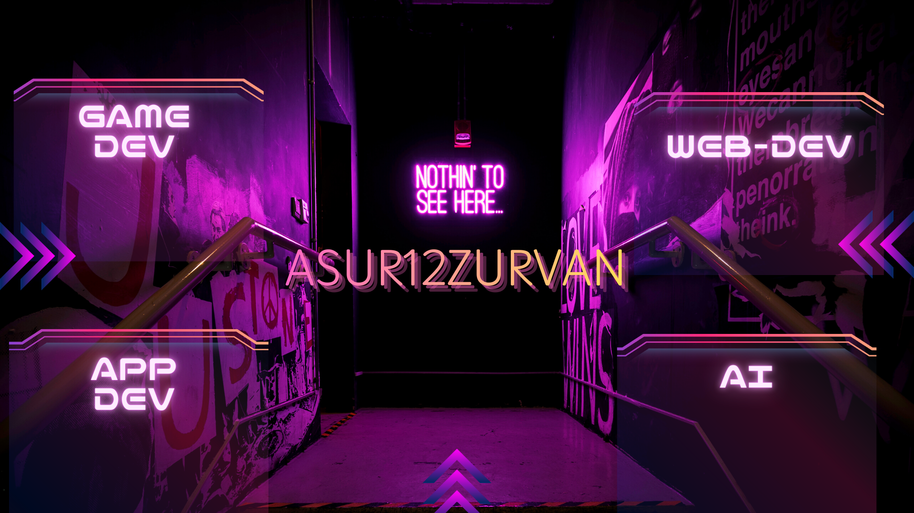

# Sumit Kumar Sahu

**DOB:** 21 October 2004  
**Location:** Bhubaneswar, Khorda, Odisha  

📞 (+91) 7978043970  
✉️ [ksumit21sahu@gmail.com](mailto:ksumit21sahu@gmail.com)

  
  

---

## 🎓 Education
- **National Institute of Technology, Rourkela** (Sept 2023 – Present)  
  *B.Tech in Computer Science and Engineering* 

---

## 📚 Relevant Coursework
- Data Structures and Algorithms  
- Database Management and Systems  
- Object-Oriented Programming  

---

## 💼 Work Experience

### Full Stack Web Dev & AR Intern – **Eyesphere Medicare** (May 2025 – June 2025) | Bhubaneswar (Remote)  
- Built and deployed a **full-stack vision testing app** with Django + PostgreSQL, improving data consistency by **42%**.  
- Developed an **AR vision-testing app** with Google ARCore + Unity XR for remote eye screening.  

### Research Intern – **IIT Bhubaneswar** (May 2025 – July 2025) | Bhubaneswar (Onsite)  
- Researched **Object Detection in Adverse Weather**, analyzing de-snowing algorithms and proposing performance improvements.  
- Annotated **1.2K+ images** with 5+ labels each, enabling YOLOv8 training and boosting detection accuracy.  

---

# 💻 Tech Stack:
                          
# 📊 GitHub Stats:
 
 

---

## 🏆 Achievements & Certifications
- **National Semifinalist – Flipkart Grid 7.0** (Aug 2025)  
  *Ranked Top 1% out of 50,000+ participants.*  
  [Certificate](https://drive.google.com/file/d/1dGbroV61UBJKpxLK_ctVxs2udnCWT9bg/view)  

- **Certificate of Appreciation – Opencode21** (Dec 2024)  
  *Recognized for open-source contributions at IIIT Allahabad.*  
  [Certificate](https://media.licdn.com/dms/image/v2/D5622AQHKGGpBMfKGPQ/feedshare-shrink_2048_1536/B56ZX0Xk0qGUAs-/0/1743561579260?e=1756339200&v=beta&t=goUJvjwk71jMO4QoOxWMGCEklPeqBd59xXLu7Hwm9lY)  

---

